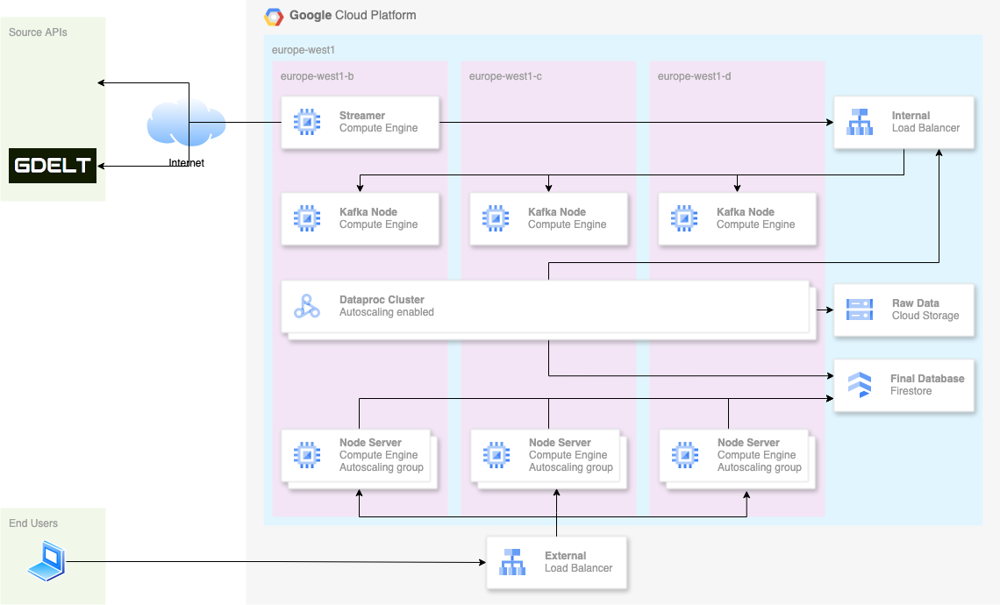

# 5MMSDTD

Ce document vise à permettre à n'importe qui ayant des accès à notre projet GCP de déployer l'infrastructure.

Tout d'abord, commencez par cloner ce repo `git`, puis suivez les étapes qui suivent.


# Architecture globale

## Schéma de l'architecture


### Légende

0. Les données brutes sont disponibles dans les APIs publiques de Coinbase (Cryptomonnaies) et GDELT (événements mondiaux).
1. Le streamer permet de récupérer les données brutes depuis nos deux APIs sources.
2. Le streamer envoie les données brutes à notre cluster Kafka.
3. Une fois les données dans Kafka, des jobs dans le cluster Dataproc récupèrent les données depuis les topics et les traitent.
4. Une fois traitées, les données sont ingérées dans un bucket GCS et dans Firestore (base NoSQL).
5. L'application finale récupère les données depuis Firestore pour les afficher sur une page web accessible à tous les utilisateurs.

## Justifications complémentaires

### Haute disponibilité

Notez que le schéma représente les différents composants de la chaîne d'ingestion/traitement/application de nos données au sein d'une région, mais dans plusieurs `availability zone`, ce qui en fait une architecture `multi-az`.
Cela est volontaire, car nous souhaitons développer une application avec une importante disponibilité pour suivre au mieux les données en temps réel.

Nous devons alors envisager une solution dans le but de répartir équitablement la charge sur les différents services `multi-az` que nous manageons nous-même. C'est le rôle du `Load Balancing` que nous mettons en place, notamment entre le `Streamer` et le cluster `Kafka`, ou encore entre les utilisateurs finaux et l'application.

Ces différents composants seront en plus placés dans des groupes d'`auto-scaling`. Cela permettra d'éviter les problèmes liés à la surcharge ou à la sous-charge générale des instances qui constituent le projet (en démarrant/terminant des instances en fonction de ces cas).

### Indépendance des niveaux

Les différents niveaux sont relativement indépendants les uns des autres. Le but de cette architecture est d'améliorer l'évolutivité du projet, tout en réduisant sa complexité.
Admettons que nous nous rendons compte que Spark n'est pas adapté au projet, nous pouvons tout à fait modifier l'entièreté du module sans avoir à toucher à l'ingestion (Kafka) ou à l'application.

## 1. Installation

Vous avez besoin d'installer les outils suivants : 
- `terraform`
- `ansible`
- `packer` (optionnel)

### Installation de terraform

Afin d'installer terraform sur votre machine, suivez les étapes fournies sur la page officielle concernant [l'installation de terraform](https://developer.hashicorp.com/terraform/tutorials/aws-get-started/install-cli).

### Installation d'Ansible

Pour installer Ansible, commencez par installer [pipx](https://developer.hashicorp.com/terraform/tutorials/aws-get-started/install-cli).

Une fois cela fait, exécutez simplement la commande suivante pour installer Ansible sur votre machine : 
```
pipx install --include-deps ansible
```

Vous pouvez ensuite vérifier son installation grâce à la commande suivante : 
```
ansible --version
```

### Installation de Packer (optionnel)

`Packer` permet de reconstruire l'image de disque disponible pour les instances du cluster de l'application finale en REACT.
Cette image de disque est déjà présente dans notre projet GCP, mais si vous souhaitez essayer l'exécution par vous même, vous devrez installer l'outil, en suivant les [étapes d'installation offcielles](https://developer.hashicorp.com/packer/tutorials/docker-get-started/get-started-install-cli).

Pour construire l'image de disque avec Packer, naviguez dans le répertoire `infra/packer` avant d'exécuter les commandes suivantes :
```
packer init
packer build app_instance_template.pkr.hcl
```

Si vous avez installé correctement `Terraform` ainsi qu'`Ansible`, vous êtes prêts à poursuivre les étapes suivantes.

## 2. Configuration GCP

Vous devez vous créer une clé d'accès dans GCP.
Pour ce faire, rendez-vous sur la [Console GCP](https://console.cloud.google.com/welcome?_gl=1*dq7bri*_up*MQ..&gclid=Cj0KCQiA4-y8BhC3ARIsAHmjC_FGaaA0HodFAaippVqqa3h_rEVdntpoZGTq5AmsRDsm-9gYtlFKbLEaAogyEALw_wcB&gclsrc=aw.ds&hl=fr&inv=1&invt=AboPBw&project=mmsdtd), choisissez le projet `5MMSDTD` (d'identifiant `mmsdtd`) puis naviguez dans `IAM > Service accounts`. 
Recherchez le compte SRV d'adresse `terraform-srv@mmsdtd.iam.gserviceaccount.com`, puis à droite les 3 bulles "actions", sélectionnez `Manage keys`. Dans l'interface, choisissez alors `Create a key`, au format `JSON`. Téléchargez-là, puis placez là à la racine du dépôt git avec le nom `personnal-terraform_srv-keys.json`.

## 3. Déploiement

Naviguez dans le répertoire `infra`, puis exécutez simplement le script `deploy.sh`. C'est terminé !

Le déploiement de l'infrastructure peut prendre une dizaine de minutes, et dépend de votre connexion internet. Il se compose de 3 étapes :
1. Compilation des fichiers `Scala`
2. Exécution du `Terraform` (création des ressources dans GCP).
3. Exécution des playbooks `Ansible` (configuration du streamer, et du cluster Kafka).


Depuis le 30 janvier, nous rencontrons une erreur, que nous pensons liée à un problème de serveur chez GCP. Voici le message d'erreur :

```bash
╷
│ Error: Error waiting for creating Dataproc cluster: Error code 14, message: The zone 'projects/mmsdtd/zones/europe-west1-d' does not have enough resources available to fulfill the request.  Try a different zone, or try again later.
│ 
│   with module.dataproc.google_dataproc_cluster.spark_cluster,
│   on modules/dataproc/cluster.tf line 46, in resource "google_dataproc_cluster" "spark_cluster":
│   46: resource "google_dataproc_cluster" "spark_cluster" {
│ 
╵
```

L'erreur semble indiquer que la zone europe-west1-d ne dispose pas de suffisamment de ressources pour créer le cluster Dataproc. C'est pourquoi nous vous informons que cette erreur pourrait survenir lorsque vous tenterez de déployer.

## 4. Observations dans la console GCP

Une fois le déploiement effectué, vous pouvez observer les différents services dans la console GCP : 
1. **VM Instance**, qui listera l'ensemble des Compute Engine utilisés dans notre infrastructure.
2. **Dataproc**, notamment avec le cluster `spark-cluster`, qui correspond à notre cluster Spark. Vous trouverez les jobs concernant l'ingestion des données de Coinbase, et de GDELT (ce dernier ne s'exécute que toutes les 15 minutes).
3. **GCS Bucket**, qui contiendra les données brutes traitées par Spark, dans le bucket de nom `test-kafka-sdtd`.
4. **Firestore**, la base de données qui contient les données traitées par Spark.
5. **Load Balancer**, notamment celui de nom `app-lb`. Vous pouvez copier le champ `external ip address and port`, et le coller comme url d'un nouvel onglet dans le navigateur : vous serez redirigé vers notre application web de visualisation des données traitées.
6. **Monitoring**, un ensemble de tableaux de bord utilisés pour surveiller notre système. Ceux à plus forte valeur ajouté sont notamment ceux intitulés `MainDashboard`, et `Kafka GCE Overview`. D'autres tableaux sont présents et tout de même utiles, par exemple pour surveiller l'auto-scaling, ainsi que nos Cloud Functions.
7. **Cloud Run Functions**, qui pour la plupart ne sont pas déployées avec `Terraform`. Elles permettent par exemple de faire en sorte qu'un job `GDELT` soit lancé toutes les 15 minutes dans `Dataproc` (`gdelt-trigger-function `), ou encore d'apporter une fois par jour un traitement post ingestion aux données dans le bucket `GCS` (`concat-files`).

Ces services devraient couvrir la majeur partie du travail réalisé au cours du projet.

## 5. Utilisation de l'application web

L'application comporte deux onglets principaux, et deux sections similaires pour chacun des onglets.
Les onglets sont :
- Données en temps réel : Vous pouvez observer l'ingestion en temps réel des données, grâce à un websocket mis en place entre votre navigateur, et les services de backend.
- Données globales : retrace les données globales contenues en base.

Les sections, quant à elles, sont les suivantes : 
- Graphique : retrace l'évolution du prix de la cryptomonnaie sélectionnée dans le menu déroulant.
- Fenetre avec scroll par page : donne les nouvelles associé à la date sélectionnée. Si beaucoup de données sont présentes, scroller vers le bas permet d'en charger davantage. Dans le cas de l'onglet "Données globales", un clique sur le graphique permet de séléctionner la date concernant les évènements à afficher.